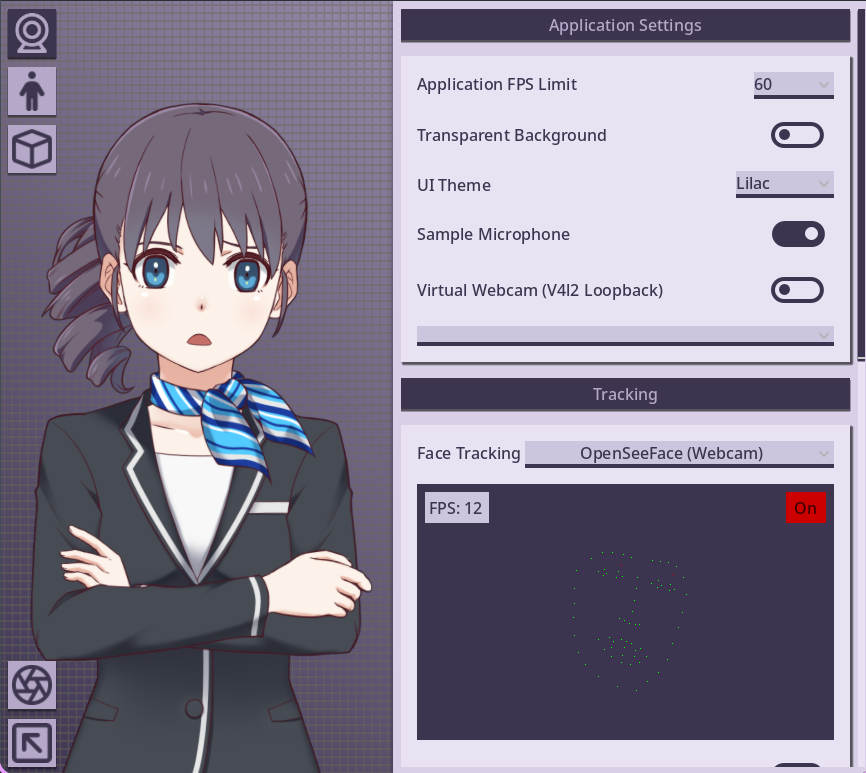

<p align="center">
  
</p>
<p align="center">
  <a href="https://github.com/erynlindensson/LilacVT/releases">Releases</a>
  ·
  <a href="https://github.com/erodozer/open-vt">Upstream open-vt</a>
</p>

<p align="center">
  
</p>

# LilacVT

**LilacVT** is an open-source VTuber application focused on Linux-first Live2D and VRM puppeteering: webcam tracking, VTube Studio–compatible assets, pickable UI, and a studio you can actually run without Windows or Unity.

This project is a downstream fork **based on, but distinct from, [open-vt](https://github.com/erodozer/open-vt)**. While it inherits core foundational concepts from the original codebase, **LilacVT** operates as an independent project with its own roadmap, features, and development standards.

Latest packaged build: **[v0.1.6](https://github.com/erynlindensson/LilacVT/releases/tag/v0.1.6)**.

Please star and support [upstream open-vt](https://github.com/erodozer/open-vt) by **[erodozer](https://github.com/erodozer)** — the Godot Live2D studio, VTS-oriented workflows, and Linux-first design started there.

---

## 🛠️ Development Philosophy & AI Integration

This repository actively utilizes modern software development tools, including AI code generation tools and agents (such as Cursor, GitHub Copilot, and LLMs), to accelerate feature development, optimize codebase performance, and implement complex features. If you have a problem with this, don't use the software.

We believe in using whatever tools enable developers to build functional, high-quality open-source software efficiently.

* **Independent Roadmap:** Features, architecture changes, and pull requests in this repository are designed for **LilacVT** specifically and are not intended to be merged back into upstream `open-vt`.
* **Code Quality & Review:** While AI agents assist in writing and analyzing code, all changes are vetted, tested, and maintained to ensure stability and compatibility.

---

## 🚀 Features

* **VRM as a first-class avatar:** import into `VrmModels`, expressions, Easy Poses, scene lighting, and per-model render quality (MSAA, anisotropic filtering, optional transparent supersampling on the avatar only).
* **Live2D that survives motion:** Ayagami-based MOC3 runtime with idle/mask white-out fixes, Cubism `physics3.json` strength/mode/per-group controls, and Open File import for `.model3.json`.
* **Webcam tracking that starts when you say so:** bundled OpenSeeFace (Start/Stop in Camera settings, smoothing slider). Experimental MediaPipe Face Landmarker on AVX CPUs only; hidden otherwise so non-AVX machines do not SIGILL. VTube Studio phone tracking still works over Wi-Fi.
* **Studio quality of life:** pickable UI themes (Lilac, Classic, Rose, Slate, Godot Dark), face-position movement, spawned items that persist across launches, in-app free Live2D/VRM catalogs, and optional transparent window for OBS alpha capture.

LilacVT stays largely compatible with [VTube Studio](https://denchisoft.com/) Live2D assets (OpenVT-specific settings stay in separate files). Feature parity with VTS remains a goal, excluding plugins and VNet.

Native Linux, open development, pixel-art filtering, and popout controls from upstream still apply.

---

## How to build

Most of the VTuber ecosystem uses Unity. LilacVT is **Godot 4** (GDScript first), with vendored **godot-vrm** / **MToon**, Ayagami for Live2D, and a local OpenSeeFace tree.

Builds currently need a custom Godot with Ayagami blend-mode patches (`godot4-ayagami`). Prefer Godot built-ins and low dependency overhead.

```bash
./build_dependencies.sh
./scripts/setup_openseeface.sh   # OpenSeeFace venv + deps
./scripts/setup_mediapipe.sh     # optional: MediaPipe venv (AVX CPUs)
godot4-ayagami --headless --path . --export-release linux bin/linux/openvt.x86_64
VERSION=0.1.6 ./scripts/package_linux_release.sh
```

Tracking needs `python3` and `python3-venv`. First OpenSeeFace start uses the network for pip packages.

---

## 📄 License & Attribution

This project is released under the **MIT License**.

* **Lineage Credit:** This software is derived from the open-source project [open-vt](https://github.com/erodozer/open-vt).
* **Copyright:** Original code copyright remains with the original authors. All modifications, new features, and ongoing maintenance for this fork are copyright (c) 2026 erynlindensson.

See the full [LICENSE](./LICENSE) file for details. Additional third-party licenses are under [`license/`](./license) and bundled release `licenses/`. Respect Live2D, VRM model, and tracker license terms for any assets you use.

### References

- Upstream open-vt: https://github.com/erodozer/open-vt
- VTube Studio: https://github.com/DenchiSoft/VTubeStudio
- OpenSeeFace: https://github.com/emilianavt/OpenSeeFace
- godot-vrm: https://github.com/V-Sekai/godot-vrm
